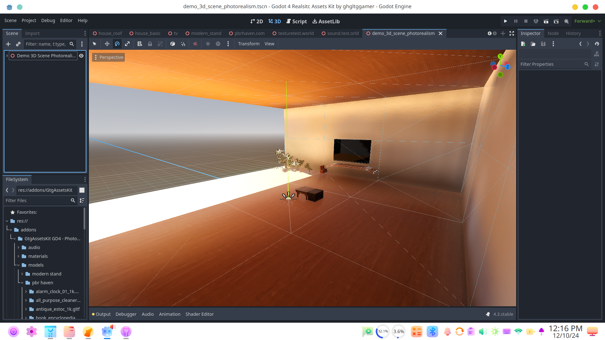

# GtgAssetsKit GD4 - Photorealism
 GtgAssetsKit GD4 - Photorealism is an OpenSource toolkit for Godot Game Engine for Creating Photo Realistic Games and Projects

Get Started with Godot Photorealism now!
